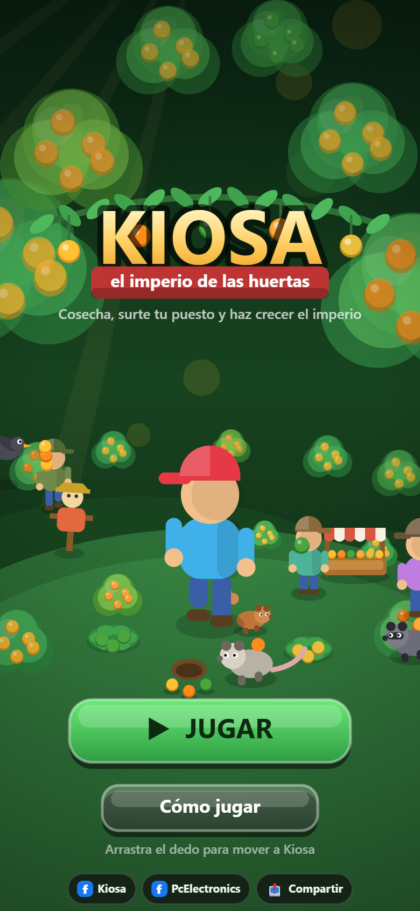
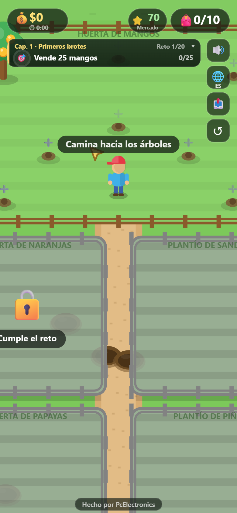
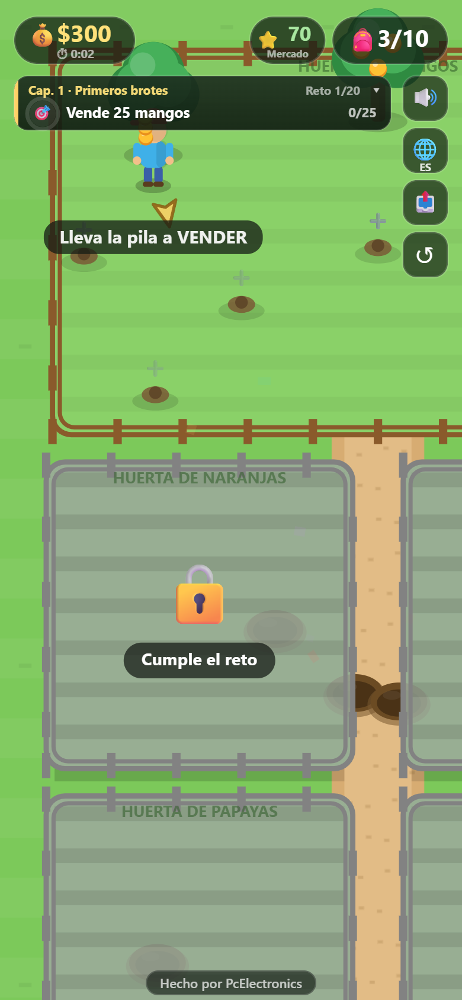
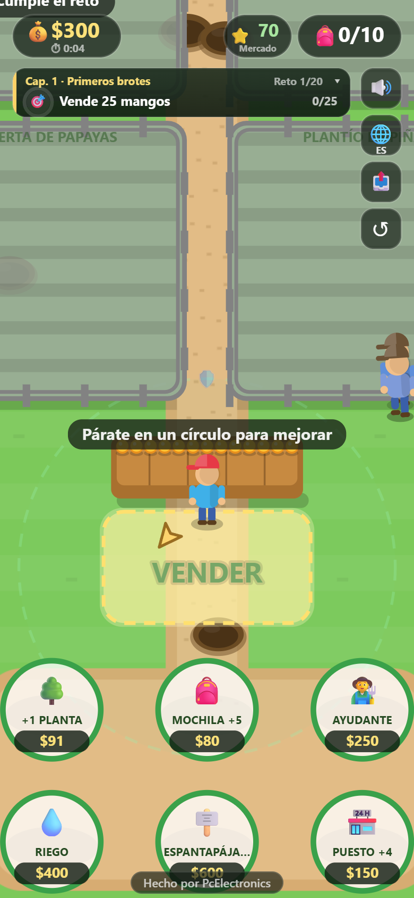
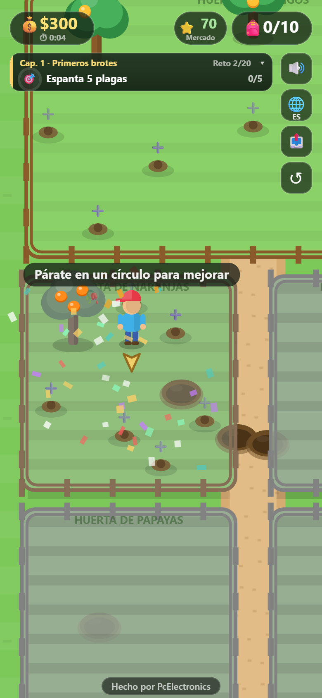
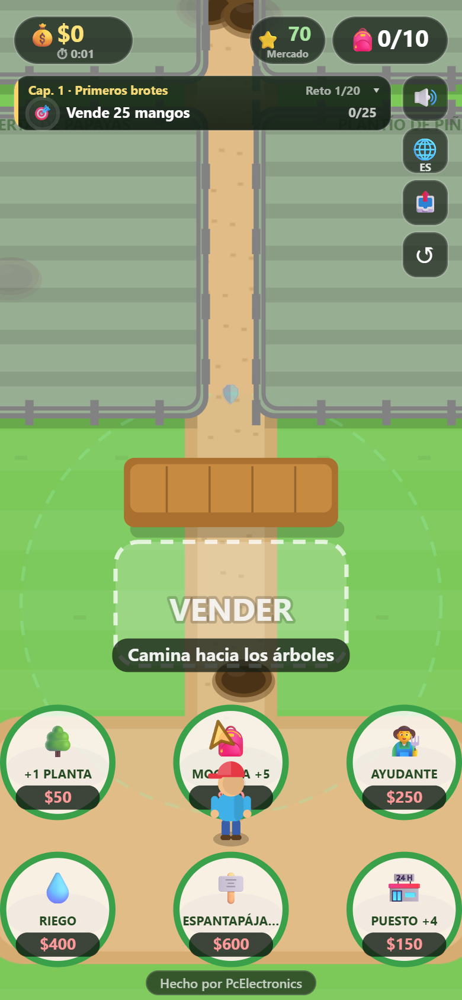
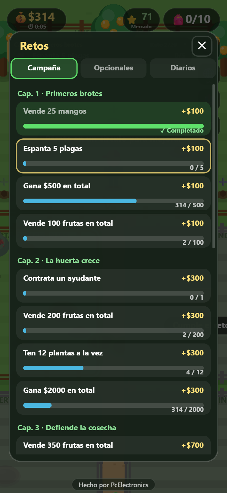
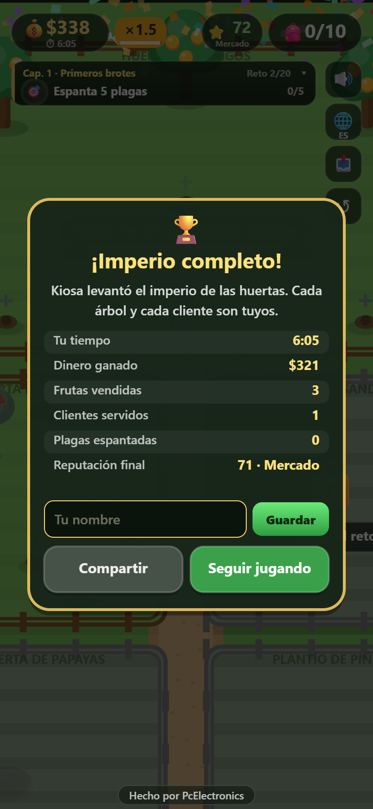

<div align="center">

# 🥭 Kiosa: el imperio de las huertas

**Un arcade idle de cosecha, venta y defensa de huertas — hecho en un solo archivo HTML, sin frameworks ni build.**

[🎮 Jugar en GitHub Pages](https://kiosa7.github.io/kiosa-el-imperio-de-las-huertas/)



</div>

---

## 🌱 De qué va

Sos Kiosa: heredaste un puesto de fruta y un solo árbol de mango. Tu trabajo es
cosechar, surtir el puesto, atender clientes y hacer crecer el negocio hasta
convertirlo en un imperio de cinco huertas — todo mientras cuidás los árboles
de las plagas, esquivás baches en el camino y espantás a los animales que
quieren robarte la cosecha.

No hay menús ni pantallas de carga: es un solo mapa que se recorre a pie
(o con el dedo, en el celular), con un ciclo simple que se va complicando
capítulo a capítulo.

<table>
<tr>
<td width="50%"></td>
<td width="50%"></td>
</tr>
<tr>
<td align="center"><sub>Empezás con un solo árbol; el resto de cupos se compran</sub></td>
<td align="center"><sub>La mochila se llena sola al acercarte a los árboles con fruta</sub></td>
</tr>
</table>

## 🕹️ Cómo se juega

1. **Cosechá** — acercate a un árbol con fruta y se junta sola en tu mochila.
2. **Surtí el puesto** — llevá la fruta a la zona VENDER; cada fruta se
   reparte sola a su propia bandeja en el mostrador.
3. **Atendé clientes** — llegan solos y piden una fruta concreta; si el
   puesto está vacío se enojan y baja tu reputación. Con buena reputación
   piden más cantidad y pagan mejor.
4. **Cuidá los árboles** — las plagas (pájaros) aterrizan y se comen la
   fruta; si no las espantás a tiempo el árbol se marchita, y si sigue sin
   curarse, **se muere** y hay que volver a comprarlo.
5. **Mejorá tu huerta** — seis círculos de mejora: más árboles, más
   capacidad de mochila, ayudantes que cosechan y venden solos, riego más
   rápido, espantapájaros automáticos y un puesto más grande.
6. **Cumplí la campaña** — 20 retos repartidos en 5 capítulos (más 8 retos
   opcionales y 3 diarios) van desbloqueando huertas nuevas — naranjas,
   sandías, papayas, piñas — hasta terminar el imperio.

<table>
<tr>
<td width="50%"></td>
<td width="50%"></td>
</tr>
<tr>
<td align="center"><sub>El puesto surtido, con clientes esperando su turno</sub></td>
<td align="center"><sub>Un naranjo marchito: si no lo curás a tiempo, se muere</sub></td>
</tr>
<tr>
<td width="50%"></td>
<td width="50%"></td>
</tr>
<tr>
<td align="center"><sub>Los seis círculos de mejora del imperio</sub></td>
<td align="center"><sub>Campaña, opcionales y diarios, con su progreso</sub></td>
</tr>
</table>

### Y además

- 🦝 **Ladrones** — mapaches, zorrillos y zarigüeyas te roban la carga si te
  cruzan en el camino; hay una zona segura alrededor del puesto donde no
  entran.
- 🕳️ **Baches** — cargado de fruta, cruzar uno puede tirarte todo al piso.
- 🌊 **Oleadas** — al cerrar cada capítulo, una tanda de plagas ataca todo a
  la vez; superarla paga un premio extra.
- 🔥 **Rachas** — atender clientes seguidos sin que ninguno se vaya enojado
  sube un multiplicador de ganancias.
- ⏱️ **Cronómetro y récords** — se mide cuánto tardás en completar el
  imperio, con una tabla de mejores tiempos guardada en el celular.
- 🌐 **Español, inglés y portugués**, con detección automática del idioma
  del navegador.

<div align="center">

</div>

## 🛠️ Tecnología

Todo el juego —lógica, dibujo, sonido, textos e interfaz— vive en
**un solo archivo `index.html`**, sin frameworks, sin paso de build y sin
dependencias externas. Se puede abrir directo desde el disco o servir con
cualquier servidor estático.

- **Render**: Canvas 2D puro, con un fondo pre-renderizado una sola vez
  (`construirFondo`) y solo redibujado con `drawImage`, más una lista de
  "dibujables" ordenada por profundidad (Y) cada cuadro.
- **Física del jugador**: velocidad con aceleración/frenado (no
  instantánea) y animación de piernas ligada a la distancia recorrida, no
  al tiempo, para que los pies no "patinen".
- **Rendimiento adaptativo**: un medidor de tiempo por cuadro
  (`medirPerf`) baja automáticamente el `devicePixelRatio` y el tope de
  partículas si el juego empieza a ir lento, sin que el jugador tenga que
  tocar nada.
- **Sonido**: sintetizado en vivo con la Web Audio API (osciladores +
  envolventes) — no hay un solo archivo de audio en el proyecto.
- **UI en canvas + overlay de HTML real**: los diálogos (confirmaciones,
  pantalla final) son un sistema de modal propio dibujado en canvas, y
  solo el campo de texto para guardar el nombre en la tabla de récords es
  un `<input>` de HTML real, posicionado sobre el canvas con matemática de
  coordenadas de cámara.
- **Persistencia**: `localStorage` con un formato de guardado versionado,
  saneado campo por campo al cargar (nunca se confía en el JSON tal cual
  viene) y con migración automática desde versiones anteriores del save —
  incluida una migración especial para que nadie pierda árboles que ya
  tenía plantados cuando cambió el sistema de "los árboles cuestan
  dinero". La tabla de récords se guarda aparte, para que reiniciar la
  partida no borre los mejores tiempos.
- **i18n propio**: un diccionario por idioma y una función `t(clave,
  parámetros)` con reemplazo de `{placeholders}`; ningún texto visible se
  escribe directo en el código.
- **Diseño de datos**: agregar una fruta nueva es agregar un objeto al
  arreglo `FRUITS` (posiciones, colores, precio) — ninguna otra lógica
  cambia. Los retos de campaña, opcionales y diarios son arreglos de datos
  con una función de progreso, no código repetido por reto.
- **PWA**: `manifest.webmanifest` + `sw.js` para poder instalarlo como app
  e ícono en el celular.
- **Despliegue**: GitHub Actions (`.github/workflows/pages.yml`) publica a
  GitHub Pages en cada push a `main`, copiando solo los archivos del sitio
  a un artefacto — sin el builder clásico de Pages, que resultó poco
  confiable para este repo.

## 📂 Estructura

```
index.html               El juego completo (HTML + CSS + JS)
manifest.webmanifest      Metadata de PWA
sw.js                     Service worker (cacheo offline)
icon-192.png, icon-512.png, og.png   Íconos y preview
docs/                     Notas de diseño e implementación
.github/workflows/        Despliegue automático a GitHub Pages
```

## ▶️ Correr en local

No hace falta instalar nada:

```bash
# opción 1: abrir index.html directo en el navegador
# opción 2: servirlo (recomendado, para que el service worker funcione bien)
npx serve .
```

---

<div align="center">
<sub>Hecho por <a href="https://www.facebook.com/PcElectronics7/">PcElectronics</a></sub>
</div>
